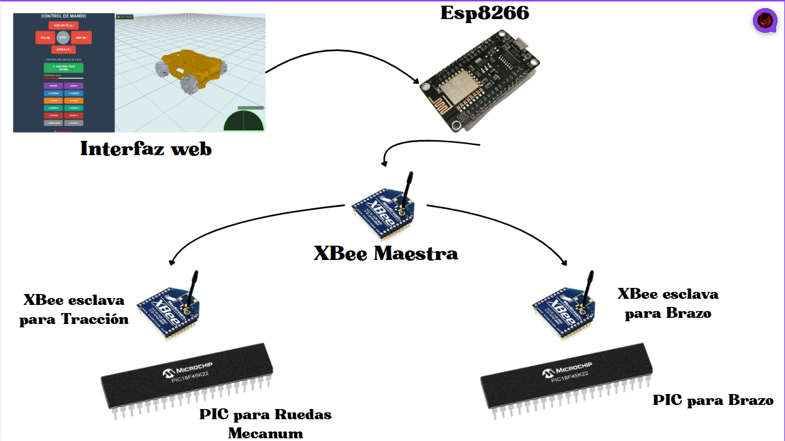
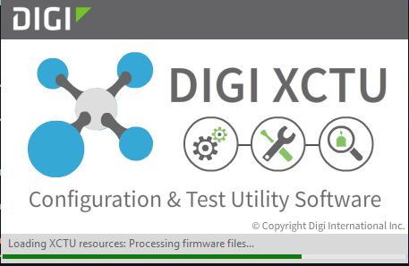

## 📡 Hardware de Comunicación: Acondicionamiento de Módulos XBee
Este documento detalla la configuración, topología de red y el protocolo de interconexión física de los módulos de radiofrecuencia XBee utilizados en el Proyecto Semillero . Estos dispositivos actúan como el puente de telemetría bidireccional entre la Interfaz Web (operada vía ESP8266) y el Microcontrolador de control de tracción (PIC18F45K22) y el Microcontralor del Brazo Robotico(PIC18f45k22).

## 1. Rol en la Arquitectura del Sistema (El Puente Transparente)
Para aislar las tareas de red (WebSockets, HTML, Wi-Fi) de las tareas de control de hardware en tiempo real (PID, PWM, Encoders), la arquitectura del proyecto separa el "Cerebro de Red" del "Cerebro Motriz".

El sistema funciona teniendo el montaje de esta manera :

El módulo XBee se configura en Modo Transparente (AT). Su única misión es emular un cable serial físico de forma inalámbrica:

Los caracteres enviados desde  los controles de la interfaz transmitidos por la ESP8266 y la XBEee maestra funciona como un puente para comunicarse con las XBee esclavas y los inyecta directamente al puerto UART del PIC1 y PIC2

Transmisión de Telemetría: Lee las cadenas JSON generadas por el PIC1 (ej. {"a":40,"d":25} del radar ultrasónico) y las transmite por el aire de vuelta a la ESP8266 para renderizar la interfaz gráfica para mostrar la telemetría como los obstaculos del sensor ultrasónico y el Gemelo Digital que muestra las llantas moviendose al mismo tiempo que el carro físico.

## 2. Parámetros de Configuración en XCTU
Para garantizar que la comunicación sea exclusiva (evitando interferencias con otros equipos de radio) y sincronizada con los procesadores, los módulos fueron acondicionados utilizando el software oficial XCTU de Digi.

Se establecieron los siguientes parámetros críticos para emparejar el Transmisor (ESP8266) y el Receptor (PIC18F45K22):

Baud Rate (BD): 9600 bps (Seleccionado estratégicamente para minimizar errores de trama de hardware a costa de una velocidad máxima aceptable para telemetría JSON ligera).

PAN ID (ID): [falta asignar] 

Destination Address (DH / DL) & My Address (MY): Direccionamiento cruzado para topología Punto a Punto. La dirección de destino de uno corresponde a la dirección local del otro.

Modo de Operación (AP): Modo Transparente (AT) (Sin tramas API, datos crudos).

## 3. Acondicionamiento Físico e Interfaz de Niveles de Voltaje
Los módulos XBee operan estrictamente a 3.3V, mientras que el microcontrolador PIC18F45K22 de la placa principal opera a 5V. Conectar los pines de datos directamente causaría daños irreversibles al XBee.

Para solucionar este conflicto de hardware, se implementó el siguiente acondicionamiento:

Se utilizaron Módulos Adaptadores / Shields para XBee que incorporan reguladores de tensión (LDO a 3.3V) integrados(WS-11293).

Los adaptadores incluyen Level Shifters (conversores de nivel lógico) en las líneas TX y RX, permitiendo que la señal de 3.3V del XBee sea leída correctamente por el PIC, y que el pulso de 5V del PIC se reduzca de forma segura a 3.3V antes de entrar al radio.

## 3.1. Cableado: El Descubrimiento de la Etiqueta Invertida
La regla fundamental de la comunicación serial dicta que la conexión debe ser cruzada (el transmisor de un lado va al receptor del otro). Sin embargo, durante la integración física descubrí una particularidad crítica en el hardware utilizado: los pines de la placa adaptadora (WS-11293) del XBee están mal etiquetados de fábrica.

El pin marcado como "TX" en la serigrafía del adaptador es internamente el RX, y el marcado como "RX" es internamente el TX. Para compensar este error de manufactura, la conexión física real entre la placa adaptadora y el microcontrolador debe hacerse de manera visualmente "recta" para lograr el cruce lógico correcto en su interior:

Pin marcado "RX" (Adaptador XBee) ➔ Pin RX real del PIC (Pin 26 / RC7)

Pin marcado "TX" (Adaptador XBee) ➔ Pin TX real del PIC (Pin 25 / RC6)

GND ➔ Tierra común de la batería principal para evitar tierras flotantes.

## 4. Trama de Datos y Flujo de Trabajo
Al configurar correctamente este puente inalámbrico, el comportamiento en código (C para el PIC y JS/C++ para la ESP) se simplifica enormemente, obviando el protocolo de radio e interactuando directamente mediante lecturas y escrituras seriales simples:

Ejemplo de flujo concurrente:

ESP8266 (XBee Tx)  ---[ "F" (Adelante) ]--->  PIC1 (XBee Rx)
ESP8266 (XBee Rx)  <---[ {"a":90,"d":15} ]--- PIC1 (XBee Tx)

La velocidad de 9600 baudios ha demostrado ser lo suficientemente robusta para manejar la ráfaga de datos del radar (barrido de 40° a 130°) sin provocar bloqueos (starvation) en el cálculo del control PID cada 50 milisegundos.