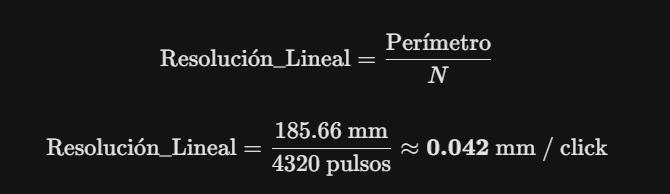

# VOLUMEN 1: Caracterización Físico-Matemática de los Actuadores

El objetivo de esta fase fue darle el sentido del "tacto" y la "vista" al microcontrolador principal (PIC18F45K22) para que dejara de ser ciego respecto a cómo se mueven las ruedas.

# 1. Especificaciones Físicas Recopiladas 
Antes de cualquier ecuación, definimos las capacidades reales de los "músculos" de tu robot a partir de las etiquetas y mediciones con calibrador:

Motor: DC Motorredactor modelo GM37-520.
Voltaje Nominal: 12V (Alimentados a través del Puente H L298N).
Caja Reductora 1:90 (El motor interno gira 90 veces para que la rueda gire 1 vez).
Velocidad Máxima Teórica en vacío: 110RPM.
Sensor de Retroalimentación: Encoder magnético de Efecto Hall en cuadratura (Canal A y Canal B).
Resolución Base del Encoder: 12 PPR (Pulsos Por Revolución del eje del motor).

2. La Matemática de la Resolución (Los "Clicks")Necesitábamos saber exactamente cuántas interrupciones eléctricas enviará el encoder al PIC por cada vuelta completa de la llanta amarilla.El encoder envía ondas cuadradas desfasadas a 90 grados. Si leemos todos los flancos de subida y bajada de ambos canales (A y B), aplicamos una técnica llamada Decodificación X4.La ecuación de resolución total (N) para tu tesis se define como:

                                                    N = PPR X Decodificación X Caja_Reductora
                                                     N = 12 X 4 X 90 = 4320 pulsos por vuelta

(Nota de ingeniería: En nuestra última prueba de código usamos decodificación X1 para simplificar, la cual cuenta solo los flancos de subida del Canal A. En ese modo, la rueda genera 1080 pulsos por vuelta. Ambos modos son válidos, pero X4 da más precisión).

# 3. Odometría Lineal (De "Clicks" a Milímetros)

Saber que da 4320 clicks no sirve de nada si no sabemos cuánto avanzó el robot en el suelo. Usando el calibrador, medimos el diámetro exacto de tu llanta Mecanum: 59.1mm.Calculamos el perímetro (la circunferencia) de la llanta:
                                                                Perímetro = π X D
                                                        Perímetro = π X 59.1 = 185.66 mm por vuelta

Ahora, la ecuación para conocer la "Resolución Lineal" (cuántos milímetros avanza el robot por cada click que recibe el PIC):

