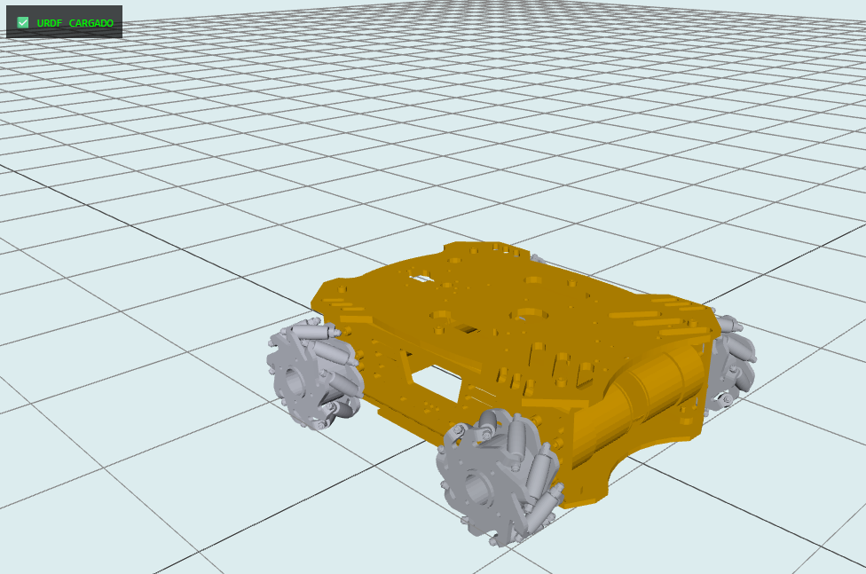
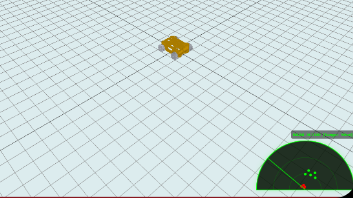

## 🌐 VOLUMEN 5: Gemelo Digital, Interfaz Web y Servidor ESP8266
Este documento describe la arquitectura de software de alto nivel del Proyecto Semillero. Detalla cómo se diseñó una interfaz gráfica HMI (Human-Machine Interface) capaz de renderizar modelos 3D y enviar comandos en tiempo real, utilizando un módulo ESP8266 como servidor local.


## 1. Arquitectura de Red (El Servidor ESP8266)
Para que el proyecto fuera 100% autónomo y no dependiera de redes de internet externas, el microcontrolador ESP8266 NodeMCU fue configurado como un Access Point (Punto de Acceso SoftAP).

El ESP8266 crea su propia red Wi-Fi llamada Robot_Mecanum. Al conectarse a esta red, el usuario interactúa con la página web almacenada y servida a través del protocolo WebSockets (Puerto 81).

## 1.1. El Filtro Anti-Spam (Código ESP8266)
Para asegurar que los comandos lleguen intactos al PIC1 sin saturar la red (colisión de paquetes), se implementó un filtro de "Ráfagas" en el ESP8266.

```
// Fragmento del filtro en ESP8266
if (c != ultimoComando) {
    Serial.write(c); // Envia la orden nueva
    ultimoComando = c;
    contadorRafa = 1;
} 
else if (contadorRafa < 5) {
    Serial.write(c); // Deja pasar hasta 5 letras idénticas (Ráfaga de seguridad)
    contadorRafa++;
}
// Las letras subsecuentes iguales se descartan para evitar saturación UART
```
Adicionalmente, el ESP8266 se encarga de escuchar la telemetría del PIC (como la velocidad o el radar) esperando el cierre de un formato JSON (}) para enviarlo a la Interfaz Web mediante la función broadcastTXT().

## 2. La Interfaz Web (HMI)
El archivo index.html es una aplicación web de una sola página (SPA) que consolida los controles físicos y la visualización virtual. Su diseño se inspira fuertemente en interfaces de control industrial (ej. Epson RC+).

## 2.1. Escudo de Controles (Pointer Events)
Para garantizar una experiencia de teleoperación industrial de tipo "Hombre Muerto" (el robot solo se mueve mientras el botón está activado físicamente), se descartó el uso de los eventos tradicionales mousedown o touchstart.

En su lugar, se implementó la API moderna Pointer Events, la cual unifica clics de ratón y toques de pantalla táctil, capturando el "puntero" para asegurar que, si el dedo resbala fuera del botón, el sistema mande inmediatamente una ráfaga de frenado (SSSSS).

```
// Captura de eventos para máxima fiabilidad
const onEnd = (e) => { 
    e.preventDefault(); 
    btn.releasePointerCapture(e.pointerId); 
    if(activeButtons[id]) { 
        activeButtons[id] = false; 
        sendCommand(releaseCmd.repeat(5)); // Ráfaga de seguridad de PARADA
    } 
}; 
btn.addEventListener('pointerup', onEnd); 
btn.addEventListener('pointercancel', onEnd); 
btn.addEventListener('pointerleave', onEnd);
```
## 3. El Gemelo Digital (URDF + Three.js)
La característica más avanzada de la Interfaz Web es la representación virtual del chasis sincronizada en tiempo real. Esto se logró importando una librería gráfica y un parseador de modelos robóticos.



## 3.1. ¿Cómo se renderiza el URDF?
Se importó Three.js (un motor 3D de WebGL) junto con urdf-loader.
El archivo carrosemillero2.urdf (Unified Robot Description Format) contiene la cinemática, los pesos y las mallas visuales de los enlaces (chasis, brazos, rodillos) diseñadas originalmente en SolidWorks.

```
// Carga del modelo en la escena de Three.js
const loader = new URDFLoader(); 
loader.load('carrosemillero2.urdf', result => { 
    robot = result; 
    scene.add(robot); 
    robot.rotation.x = -Math.PI / 2; // Ajuste de ejes Z-up a Y-up
});
```

## 3.2. Sincronización Físico-Virtual
Cuando el usuario oprime un botón, el PIC1 envía un JSON al ESP8266 confirmando que las llantas están girando (ej. {"v":0.1}).
La función animate() de Three.js intercepta este valor y lo aplica a las articulaciones (joints) definidas en el URDF, haciendo que el modelo 3D gire a la par del chasis físico.

```
// Bucle maestro de renderizado 
function animate() { 
    requestAnimationFrame(animate); 
    if (robot) { 
        // Identifica los enlaces de las 4 llantas y les suma la velocidad recibida
        const joints = { fl: 'rdi', fr: 'rdd', rl: 'rti', rr: 'rtd' }; 
        for (const key in joints) {
            if (robot.joints[joints[key]]) {
                robot.joints[joints[key]].setJointValue(robot.joints[joints[key]].angle + wheelVelocity); 
            }
        }
    } 
    renderer.render(scene, camera); 
}
```
## 3.3. Escalabilidad: Cambiar el URDF a futuro
El sistema es modular. Si en el futuro se rediseña el chasis o se cambia la pinza del brazo robótico, no es necesario reescribir la página web. Solo se deben seguir estos pasos:

Exportar el nuevo diseño desde SolidWorks usando el plugin URDF Exporter.

Guardar el nuevo archivo como nuevo_modelo.urdf en la raíz del servidor.

Cambiar la línea loader.load('carrosemillero2.urdf', ...) por el nuevo nombre del archivo.

(Opcional): Si los nombres de los motores/articulaciones en SolidWorks cambiaron (ej. de rdi a llanta_frontal), actualizar el diccionario const joints en la función de animación.

## 4. Visualización Sensorial (Radar Canvas)
Finalmente, se integró un lienzo HTML5 (<canvas>) superpuesto a la vista 3D para renderizar el radar ultrasónico.
La función drawRadar() procesa los paquetes JSON {"a":40,"d":25} convirtiendo coordenadas polares (Ángulo y Distancia) en coordenadas cartesianas (X, Y) mediante trigonometría (Math.cos y Math.sin), dibujando la posición de los obstáculos en tiempo real y cambiando su color a rojo si infringen el umbral de seguridad de 7cm.



# 🌐 VOLUMEN 5.1: Despliegue Local y Análisis del Motor Gráfico (HMI)

Este anexo profundiza en las restricciones de seguridad de los navegadores web modernos, la necesidad de un servidor local para la carga de modelos 3D y desglosa matemáticamente la renderización del radar ultrasónico en el Canvas HTML5.

## 1. El Problema del CORS y el Servidor Local Python

Para abrir la interfaz web en una computadora, no basta con hacer "doble clic" sobre el archivo `index.html`. Si se intenta esto, el navegador abrirá el archivo utilizando el protocolo local de archivos (`file:///C:/...`), lo cual provocará que el Gemelo Digital (el archivo URDF) no se cargue en la pantalla, mostrando un error en la consola.

**¿Por qué sucede esto?**
Los navegadores modernos implementan una estricta política de seguridad llamada **CORS (Cross-Origin Resource Sharing)**. Esta política prohíbe que el código JavaScript (como la librería `urdf-loader` o `Three.js`) haga peticiones para leer otros archivos locales alojados en el disco duro. Es una medida crítica para evitar que páginas web maliciosas roben información de la computadora del usuario.

**La Solución: `python -m http.server 8000`**
Para engañar al navegador y que trate nuestros archivos del proyecto como si fueran una página web real alojada en internet, utilizamos Python. Al abrir la terminal (cmd o PowerShell) en la carpeta del proyecto y ejecutar este comando, Python levanta un pequeño servidor web de desarrollo en el puerto 8000.
* Al acceder a `http://localhost:8000` en el navegador, la petición de red viaja por el protocolo estándar HTTP.
* El navegador confía en este origen (Localhost) y permite que los scripts descarguen, lean y parseen el archivo `carrosemillero2.urdf` y sus texturas asociadas sin bloqueos de seguridad.

## 2. Análisis Profundo del Radar Ultrasónico (Canvas 2D)

El visualizador del radar en la interfaz no es una simple animación pregrabada ni un video; es una representación gráfica dinámica calculada en tiempo real. Traduce coordenadas polares (recibidas vía JSON) a coordenadas cartesianas en la cuadrícula de píxeles del monitor.

### 2.1. Memoria de Barrido (Persistencia de Visión)
El sistema no dibuja solo lo que ve en un instante dado, sino que tiene "memoria". Utiliza un arreglo (Array) de 181 posiciones matemáticas (`radarData[181]`) que representa cada grado posible del servo motor (de 0° a 180°). 
Cuando llega un paquete de telemetría JSON, por ejemplo `{"a":40,"d":25}`, el sistema almacena la distancia `25` exactamente en el índice `40` del arreglo. Al dibujar, el código recorre los 181 grados, pintando los ecos acústicos anteriores y generando un efecto de "rastro de fósforo" clásico de los radares industriales.

### 2.2. Matemática de Transformación Espacial
El área de dibujo (Canvas) es un rectángulo estricto de 300x150 píxeles, donde el origen físico del radar se ubica en el centro-inferior. Para pintar un obstáculo en pantalla, el algoritmo convierte las coordenadas polares recibidas del PIC1 (Distancia radial **R** y Ángulo **θ**) a coordenadas cartesianas **(X, Y)** mediante trigonometría computacional:

`X = Cx + R * cos(180° - θ)`
`Y = Cy - R * sin(180° - θ)`

* Donde **Cx** y **Cy** representan las coordenadas del punto central de origen del radar en el Canvas.
* **R** es la distancia escalada (donde 50cm reales del HC-SR04 equivalen al 100% de la altura visual del Canvas).
* **θ** (Theta) es el ángulo del servo, previamente convertido a radianes.

### 2.3. Lógica de Umbral Crítico (Collision Warning)
Durante el ciclo de renderizado, la interfaz evalúa condicionalmente la distancia de cada punto detectado almacenado en memoria. Si la distancia matemática es **<= 7** (7 centímetros o menos), el motor cambia el estilo de llenado (`fillStyle`) del punto de verde neón (`#00ff00`) a rojo alerta (`#ff0000`). Esto traslada la lógica de exclusión que ocurre en el hardware del chasis (LED físico) directamente a la consciencia visual del operador en la interfaz.